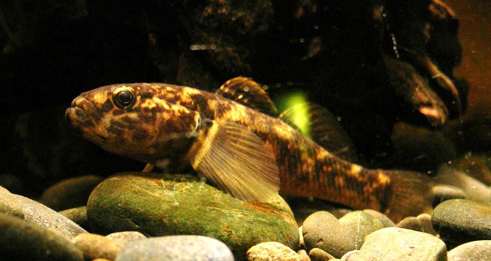
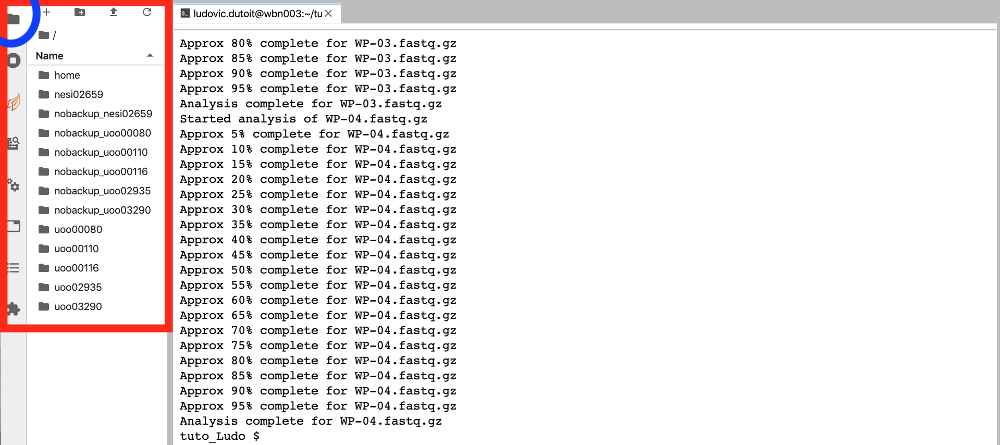
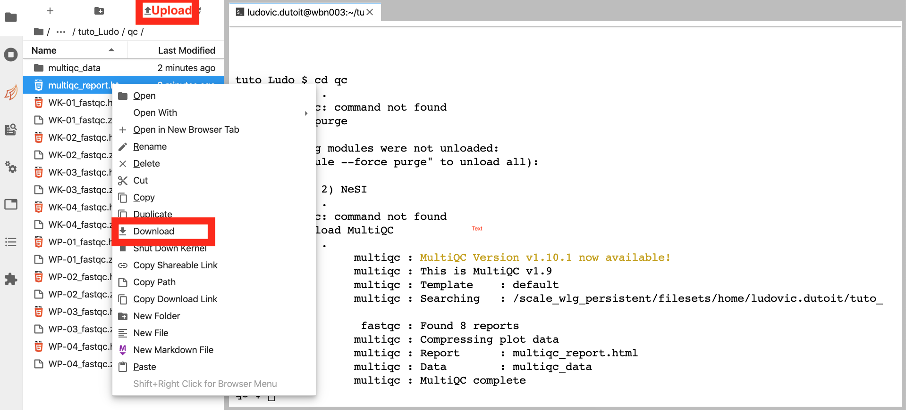

## Quality Control for Genomic Data

Ludovic Dutoit | May 2021

## Dataset

Today we are working with some exciting real world data. 

[Dr Travis Ingram](https://www.otago.ac.nz/zoology/staff/ingram.html) sampled common bullies (*Gobiomorphus cotidianus*) from 5 to 90 m depth in four South Island lakes to test for morphological and ecological differences associated with depth in those fishes. After identifying some consistent body shape differences associated with depth, he wondered whether those differences reflected population structure and proceeded with genetic analyses for fishes sampled from two of those lakes (lake Wanaka and  lake Wakatipu) using a technique called [Genotyping-by-Sequencing](https://sapac.illumina.com/techniques/sequencing/dna-sequencing/targeted-resequencing/genotyping-by-sequencing.html).

 <br>
Picture: [Zureks](https://en.wikipedia.org/wiki/Common_bully#/media/File:Common_bully,_Gobiomorphus_cotidianus.jpg)

While today's workshop is not going further than Quality Control of the data, You can find the published paper [here](https://cdnsciencepub.com/doi/abs/10.1139/cjfas-2020-0015). Should you be interested, [this tutorial](https://github.com/ldutoit/bully_gbs/blob/master/populationstructure_tuto/populationstructure_tuto.md) will allow you to explore population structure in those fishes using a pre-processed set of 9605 genetic variants.

## Raw genetic data format

We'll first navigate to our home directory by typing:

```bash
cd 
pwd
```

we'll create a folder in which we can work for today:

```bash
mkdir tuto_insertyourname
cd tuto_insertyourname
```

If your name is Jo:

```bash
mkdir tuto_Jo
cd tuto_Jo
```

We'll then download our dataset for today and unzip it. There are other ways to get your data onto NeSI from your own computer, but a quick download will be the most efficient for us today. We'll use the wget command to download a file and name that downloaded file `raw_data.tar` using the `-O` parameter

```bash
wget --no-check-certificate 'https://tinyurl.com/rawingram' -O raw_data.tar
```

you can use `ls` that stands for *list* to see the content of directories. We will then decompress this newly downloaded `tar` archive folder. 

```bash
ls
tar xvf raw_data.tar
ls raw_data/
```

There are 8 samples, 4 from lake Wakatipu (WK)and 4 from lake Wanaka (WK).

The [fastq format](https://medium.com/@robertopreste/phred-quality-score-2837415f0af) is a standard way of storing raw genetic data.

Let's have a look at one of those files together using the command ```less```

```bash
less -S raw_data/WK-01.fastq.gz
```


Each read is on four lines:

* Line 1 start with a '@' character followed by a unique read identifier
* Line 2 is the sequence
* Line 3 begins with a '+' character and is sometimes by the sequence identifier (not in our case
* Line 4 encodes the quality values for the sequence in Line 2, Each base quality is encoded as one letter according to a  [translation table](https://medium.com/@robertopreste/phred-quality-score-2837415f0af). The quality score is called the PHRED score and is on a log-scale. A PHRED score of 10 means that this base has been called with a probability of error of 10% while a score of 20 only has a 1% error probability.

| Phred Quality Score |Incorrect base call prob| Accuracy |
|---------------------|-------------------|--|
| 10                  | 1 in 10               |90%| 
| 20                  | 1 in 100           |99%|
| 30                  | 1 in 1000              |99.9%|
| 40                  | 1 in 10000             |99.99%|

### Quality control of individual files using FastQC

It is not very practical to look at all those reads manually, but it is always a good idea to have a very quick look at your data.

```FastQC``` is a great software to summarise `.fastq` files.

NeSI comes with a whole suite of pre-installed softwares, and [FastQC](https://www.bioinformatics.babraham.ac.uk/projects/fastqc/) is one of them. All those softwares are stored away in boxes called *modules* that you can access whenever you need to.

Loading software on the server is a case-sensitive process. We need to find the exact name under which the module is stored inside the system.

To find a module including the word *fastqc* in its name or description:

```bash
module spider fastqc
```

Now that we found it, we can load it:

```bash
module load FastQC
```
Before running the software we''ll create a `qc` folder to store cleanly our quality control files next to our raw_data folder.

```bash
pwd
mkdir qc
```

```bash
fastqc raw_data/* -o qc/
```

the star is a little *wild card* that means *everything*. In our case we run fastqc on all the files that are inside `raw_data/` and store the output `-o` inside the folder qc.

We'll be navigating through the file explorer on the left of your screen to find find the output of FastQC inside `/home/tuto_YOURNAME/qc/`.



If you cannot find your file, you can follow the path through [here](navigatefastqcoutput.md).

Now that you had a good look at one or two file, you can see that FastQC is a fast and efficient way to look at your samples, summarising information on thousands of reads efficiently. But what if you have a lot of samples, are you going to have to look through each FastQC output to file to find the potential *bad apple*?

### MultiQC

[MultiQC](https://multiqc.info/) aggregates results from bioinformatics analyses across many samples into a single report. Today, we'll just aggregate our results from the fastqc analysis, but MultiQC recognises log files of many different softwares and is an excellent way of keeping track of your samples along an analysis pipeline whether.

Find and load MultiQC

```bash
module spider MultiQC
module load MultiQC
```

Go inside your `qc` folder and run `multiqc` with a single parameter `.`, asking multiqc to find log files inside this very folder.

```bash
cd qc 
multiqc .
```

Do you want to share this file with someone or save it on your laptop? You can Download using right-click on that file. You want to bring your own local file onto the server? Use the little upper arrow on the file explorer. 

Visualise the multiqc_report.html file just produced besides your `fastqc file`.



Well done! You have completed the quality control of this data!

[Let's learn how to remove those adapters](remove_adapters.md)

[Lesson summary](lesson_summary.md)

[Back to the homepage](index.md)

