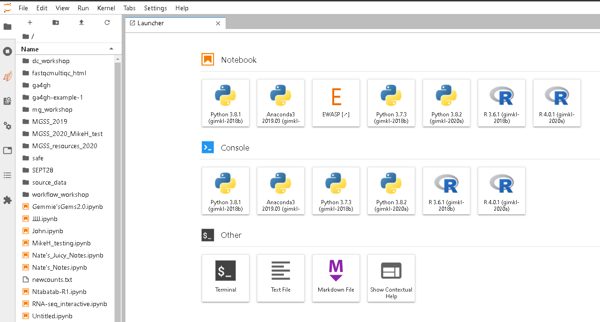

>**WARNING**- We **do not recommend** using Internet Explorer to access [NeSI JupyterHub](https://jupyter.nesi.org.nz/hub/login)

1. Follow https://jupyter.nesi.org.nz/hub/login
2. 
Enter NeSI username, HPC password and 6 digit second factor token 

3. 
Choose server options as below OR as required for the session
>Project code is up to you for today, number of CPUs and memory size will remain unchanged. However, select the appropriate  **Wall time** based on the projected length of your session. In our case select 2h.

 

4. Jupyter Launcher screen
  

5. Click on Terminal on the bottom of the launcher. You are now ready to enter commands! Put a green sticker on your computer and get back to the homepage.

[Back to homepage](index.md)
