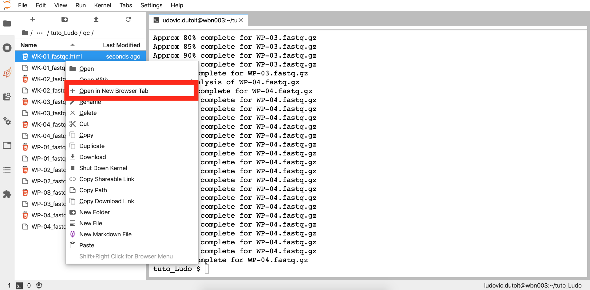

# find your FastQC file

1. Select the explorer in the blue screen below. You should see a list of directories. 

2. Select the directory named `home`

3. Select your tutorial folder, in my case it is named `tuto_Ludo`

4. Select `qc`

5. Right click on one of the .html files and select *Open in new browser tab*_

